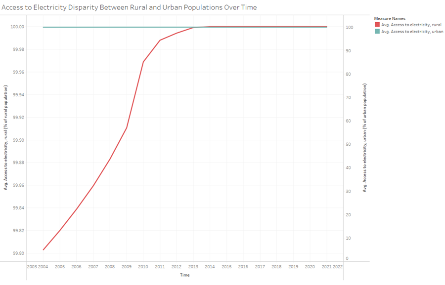
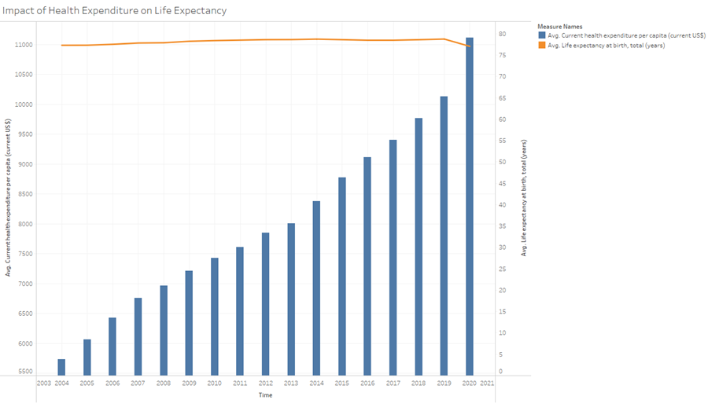

# Project Overview: 

Exploring Environment-Health Dynamics

## 1. Introduction

This project investigates how environmental factors impact public health using World Bank data. We leverage Tableau to analyze trends and disparities across indicators like access to amenities, health spending, and mortality rates.

## 2. Data Preparation

We use World Bank datasets covering electricity, water, health spending, mortality, and environmental metrics.

## 3. Topic and Questions

We explore questions like:
- How does access to amenities vary between rural and urban areas?
- Is there a link between clean fuels and mortality rates?
- How does health spending relate to life expectancy?
- Do greenhouse gas emissions affect clean cooking fuels access?

### Access to Electricity Disparity Between Rural and Urban Populations Over Time
- How does access to electricity vary between rural and urban populations over time in different countries?
  

### Trend in Basic Drinking Water Services in Urban Areas Across Countries
- What is the trend in the percentage of people using at least basic drinking water services in urban areas across various countries?
  

### Relationship Between Access to Clean Cooking Fuels and Mortality Rates
- Is there a correlation between access to clean fuels and technologies for cooking and mortality rates, particularly infant mortality rates?
  

### Impact of Health Expenditure on Life Expectancy
- How does current health expenditure per capita correlate with life expectancy at birth?
  

### Relationship Between Greenhouse Gas Emissions and Access to Clean Cooking Fuels
- What is the relationship between total greenhouse gas emissions and access to clean fuels and technologies for cooking?
  

### Correlation Between Hospital Beds and Infant Mortality Rate
- Is there a correlation between infant mortality rate and hospital beds per 1,000 people?
  

### Comparison of Access to Clean Cooking Fuels Between Rural and Urban Areas
- How does the access to clean fuels and technologies for cooking differ between rural and urban populations in different countries?
  

### Urban Population Growth VS Drinking Water Service
- Does the rate of urban population growth affect the availability and quality of drinking water services in urban areas?
  

### Life Expectancy vs Basic Drinking Water Service (Using Groups)
- Is there a relationship between life expectancy and the availability of basic drinking water services, when considering data grouped in five-year intervals?
  

### Trend in Maternal Mortality Rate Across Countries and Time
- What is the trend in maternal mortality rate across different countries and over time?
  

### Life Expectancy vs Access to Clean Fuels and Technologies for Cooking
- Does access to clean fuels and technologies for cooking correlate with life expectancy across different regions and countries?

